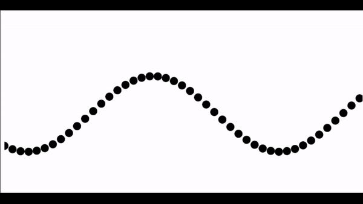

# Transverse Wave
Animation describing a transverse wave. In a transverse wave the particle displacement is perpendicular to the direction of wave propagation. This is shown in the animation where the particles are just moving up and down.

## Made Using
* `p5js`

